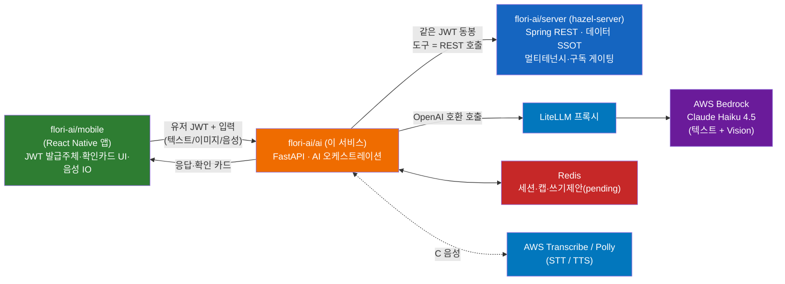
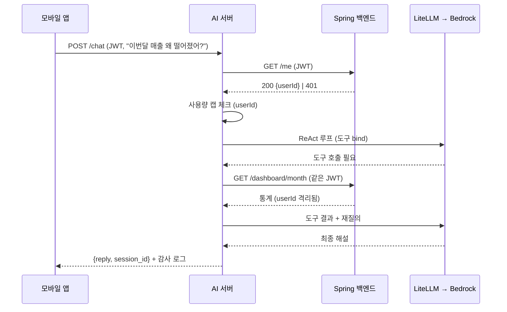
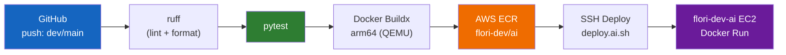

# flori-ai

> 카톡 스크린샷 한 장이면 예약 완료. 바쁜 1인 꽃집 사장님을 위한 FastAPI + LangGraph AI 서비스.


---

## 목차

- [개요](#개요)
- [Quick Start](#quick-start)
- [환경 설정](#환경-설정)
- [아키텍처](#아키텍처)
- [프로젝트 구조](#프로젝트-구조)
- [기술 스택](#기술-스택)
- [인증](#인증)
- [CI/CD](#cicd)
- [문서](#문서)

---

## 개요

Flori(꽃집 SaaS)의 프리미엄 AI 기능을 담당하는 **별도 AI 서비스**다. **백엔드 DB에 직접 접근하지 않고**, 기존 Spring REST API(`flori-ai/server` = `hazel-server`)를 LangGraph 도구로 호출하는 얇은 오케스트레이션 레이어다. 멀티테넌시·구독 게이팅은 Spring이 강제하며, 유저 JWT는 매 백엔드 호출에 그대로 전달된다. LLM·Vision은 단일 멀티모달 모델 — **LiteLLM 프록시 → AWS Bedrock Claude Haiku 4.5** — 로 처리한다.

### 기능 시퀀싱

| 단계 | 기능 | 설명 |
|------|------|------|
| **A** | 데이터 분석 | 통계 API를 읽어 LLM이 매출·예약 추세를 해설 (읽기전용) |
| **B** | OCR → 예약 | 카톡 스크린샷 → 비전 LLM 추출 → 확인 카드 → 예약 생성 |
| **C** | 음성 | 음성 지시 → STT → 에이전트 → 음성 응답 (C1 푸시투토크 → C2 실시간) |
| **D** | 에이전트 | A·B·C 도구를 묶은 다단계·선제 제안 에이전트 |

### 책임 분담

| 레이어 | 책임 |
|--------|------|
| **flori-ai/ai (이 repo)** | AI 오케스트레이션 — 도구콜 루프, 비전 OCR, 음성 세션, 확인 카드, 사용량 캡, 감사 로깅 |
| flori-ai/server (`hazel-server`) | Spring REST API. 데이터 SSOT, 멀티테넌시·구독 게이팅, `user_id` 격리. AI 도구가 래핑하는 검증된 표면 |
| flori-ai/mobile | React Native 앱. JWT 발급주체, 확인 카드 UI, 음성 IO |
| LiteLLM → Bedrock | Claude Haiku 4.5 (텍스트 + Vision). 프록시 단일 진입점 |

---

## Quick Start

### 필수 요구사항

- Python 3.12+
- [uv](https://docs.astral.sh/uv/)
- Docker (로컬 Redis용)

### 실행

```bash
# 1. 클론
git clone <repository-url>
cd flori-ai/ai

# 2. 환경변수 설정
cp .env.example .env        # 값 채우기 (아래 환경 설정 참조)

# 3. 의존성 설치
uv sync

# 4. 로컬 Redis 띄우기
make up                     # docker compose up -d redis

# 5. 서버 실행 (hot-reload, :8000)
make dev                    # uv run uvicorn app.main:app --reload --port 8000
```

`Makefile` 단축 명령 (`make` 로 목록 확인): `make dev`(실행) · `make test` · `make lint` · `make fmt` · `make up`(로컬 Redis) · `make down`.

---

## 환경 설정

`.env.example` 를 `.env` 로 복사해 값을 채운다. 시크릿은 코드·깃에 두지 않는다.

| 변수 | 설명 | 필수 | 기본값 |
|------|------|------|--------|
| `LITELLM_BASE_URL` | LiteLLM 프록시 주소 | O | `http://localhost:4000` |
| `LITELLM_API_KEY` | LiteLLM API 키 | - | - |
| `LLM_MODEL` | 모델명 (LiteLLM 등록 이름) | - | `claude-haiku-4-5` |
| `BACKEND_BASE_URL` | Spring 백엔드(도구 대상) 주소 | O | `http://localhost:8080` |
| `REDIS_URL` | Redis 접속 URL (세션·캡) | O | `redis://localhost:6379/0` |
| `ME_CACHE_TTL_SECONDS` | `/me` 인트로스펙션 캐시 TTL | - | `60` |
| `REQUEST_TIMEOUT_SECONDS` | 백엔드 호출 타임아웃 | - | `30` |
| `USAGE_CAP_PER_DAY` | 유저별 일일 호출 캡 | - | `500` |
| `SESSION_TTL_SECONDS` | 세션 TTL | - | `86400` |
| `AWS_REGION` | 음성(Transcribe/Polly) 리전 | C 단계 | `ap-northeast-2` |
| `POLLY_VOICE` | Polly 음성 | - | `Seoyeon` |
| `TRANSCRIBE_LANGUAGE` | Transcribe 언어 | - | `ko-KR` |

> Bedrock 자격(`AWS_ACCESS_KEY_ID` 등)은 LiteLLM 프록시가 사용한다. env로만 주입하고 코드·깃에 두지 않는다.

---

## 아키텍처



> 상세 아키텍처 및 기술 선정 이유는 [`docs/ARCHITECTURE.md`](docs/ARCHITECTURE.md)·[`docs/DESIGN.md`](docs/DESIGN.md) 참조

### 요청 흐름 (A 데이터 분석 예시)



- **AI 서버**: 인증(`/me` 패스스루) → 사용량 캡 → ReAct 도구콜 루프 → 백엔드 읽기/쓰기 제안 → 응답·확인 카드
- **쓰기는 human-in-loop**: 예약 생성 등 쓰기는 "제안 → 확인 카드 → `/confirm` 실행" 경유만
- **전송계층 추상화**: HTTP/SSE(C1) → WebSocket(C2) 전환 시 `run_voice_turn` 재사용, 전송계층만 교체

---

## 프로젝트 구조

```
app/
├── main.py             # FastAPI 앱 + lifespan(자원 구성) + 라우터 등록
├── api/                # 전송: health, whoami, chat, ocr, confirm, voice, voice_ws, proactive, deps, validators
├── agents/             # react_loop(ReAct 루프), prompts, llm_client, vision, proactive, graph(스켈레톤)
├── tools/              # registry — 백엔드 읽기 도구 + 디스패치 + OpenAI 스키마
├── backend/            # client(httpx, JWT 패스스루), auth(/me 인트로스펙션)
├── session/            # models(Session/Turn/PendingWrite), store(Redis)
├── confirm/            # models(ReservationDraft/ConfirmationCard), store, executor
├── voice/              # ports(STT/TTS Protocol), pipeline(run_voice_turn), aws(Transcribe/Polly)
├── core/               # config, usage(캡), audit(감사), errors
├── observability/      # tracing(@observe, Langfuse seam)
└── models/             # 공유 DTO
```

레이어: `api(전송) → agents(오케스트레이션) → tools(백엔드 래퍼) → backend(REST 클라이언트)` + 횡단(session/confirm/voice/core/observability). **DB 레이어 없음** — 영속은 전부 백엔드, AI는 Redis(휘발성 세션·캡)만 소유.

---

## 기술 스택

| 영역 | 기술 |
|------|------|
| 언어/패키지 | Python 3.12+ / uv |
| 프레임워크 | FastAPI + uvicorn (HTTP + WebSocket) |
| 에이전트 | LangGraph (골격) + 직접 구현 ReAct 루프 (`langchain-openai` `bind_tools`) |
| LLM & Vision | LiteLLM 프록시 → AWS Bedrock Claude Haiku 4.5 |
| STT / TTS | AWS Transcribe(스트리밍) / AWS Polly(Seoyeon, neural) — Port 추상화 |
| 스키마 | Pydantic v2 |
| HTTP | httpx (async) |
| 세션 & 캐시 | Redis |
| 관측성 | Langfuse `@observe` (선택, no-op 폴백) |
| 테스트 & 린트 | pytest / ruff |

---

## 인증

AI 서버는 JWT를 발급·서명검증하지 않는다. 클라이언트(앱)가 백엔드에서 받은 유저 JWT를 AI 서버에 전달하면, AI 서버는 백엔드 REST 호출에 **그대로 전달(pass-through)** 한다. 격리·게이팅은 Spring이 보장한다. 경량 검증은 `GET /me` 인트로스펙션(60초 캐시)으로 JWT 유효성과 `userId`만 확보한다. 자세한 내용은 [docs/DESIGN.md](docs/DESIGN.md) §5(보안 모델) 참조.

---

## CI/CD



| 워크플로 | 트리거 | 설명 |
|----------|--------|------|
| `ci.yml` | PR / push (`dev`, `main`) | ruff(lint+format) → pytest. 검증 게이트 |
| `deploy-ai-dev.yml` | push (`dev`, `main`) / 수동 | ruff·pytest → arm64 빌드 → ECR(`flori-dev/ai`) → SSH 배포 |

- **이미지 태그**: `{KST-timestamp}-{short-SHA}` + `latest`
- **빌드**: x64 러너 + QEMU 로 arm64 크로스빌드 (org ARM 러너 미가용)
- **배포**: SSH → `deploy.ai.sh {image_tag}` → ECR pull → Docker run

---

## 문서

| 문서 | 내용 |
|------|------|
| [docs/ARCHITECTURE.md](docs/ARCHITECTURE.md) | as-built 전체 아키텍처 — 토폴로지·엔드포인트·레이어·보안·스택 |
| [docs/DESIGN.md](docs/DESIGN.md) | 설계 결정·근거·탈락 후보·보안 모델·도구 카탈로그·대화 세션 (SSOT) |
| [docs/features/](docs/features/README.md) | 기능별 아키텍처·플로우 — A(데이터 분석)·B(OCR→예약)·C(음성)·D(에이전트) |
| [docs/conventions/](docs/conventions/) | 코딩 컨벤션 (작업 전 필독) |
| [ROADMAP.md](ROADMAP.md) | SPEC 목록·순서·상태 |
| [HANDOFF.md](HANDOFF.md) | 직전 세션 상태·다음 할 일 |
| [CLAUDE.md](CLAUDE.md) | 자율 실행 프로토콜·스택·보안 체크리스트 |

> 인프라(EC2/ECR/Bedrock 모델 액세스/배포)는 이 repo 범위 밖 — 사용자가 직접. 로컬 docker-compose(ai-server + redis)와 LiteLLM 연동만 포함.
