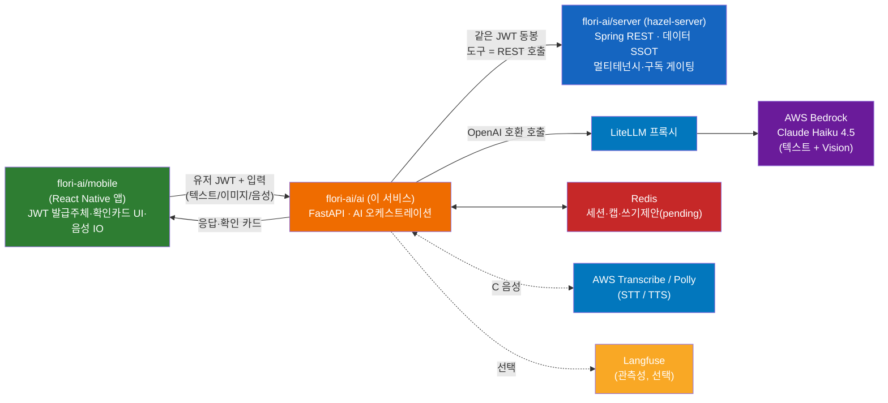
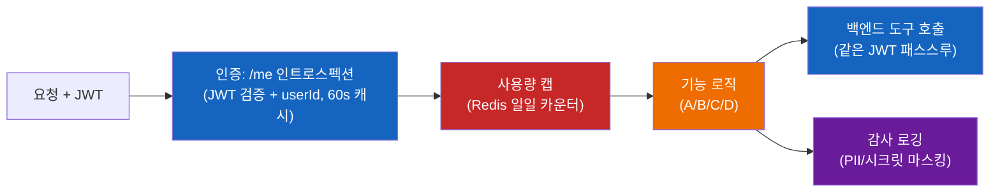

# Flori AI — 아키텍처 (as-built)

> 최종 업데이트: 2026-05-28
>
> ⚠ **부분 stale**: 2026-06-04 게이트웨이 stateless 전환(PR #7) 이후 인증(`/me` 인트로스펙션 → 게이트웨이 내부키 신뢰), 사용량 캡(게이트웨이 소유), `/confirm`(게이트웨이로 이동), 대화 세션(게이트웨이 소유)이 바뀌었다. §2 엔드포인트 맵의 `/confirm`, §4 수명주기의 캡, §5의 `/me`/캡 항목은 전환 이전 표기다. 최신 상태는 [../HANDOFF.md](../HANDOFF.md)(2026-06-04) 참조 — 본 문서 전체 갱신은 후속 작업.

실제 구현된 전체 그림. 설계 의도·결정·근거는 [DESIGN.md](DESIGN.md)(SSOT), 기능별 상세는 [features/](features/) 참조.

> 한 줄 요약: 꽃집 사장님용 AI 서비스(FastAPI + LangGraph 기반). **백엔드 DB에 직접 접근하지 않고** 기존 Spring REST(`hazel-server`)를 도구로 호출하는 얇은 오케스트레이션 레이어. 유저 JWT를 백엔드에 그대로 전달해 멀티테넌시·구독 게이팅을 Spring이 강제한다.

## 1. 시스템 토폴로지



## 2. 엔드포인트 맵

| 엔드포인트 | 기능 | 인증 | 쓰기 | 파일 |
|-----------|------|------|------|------|
| `GET /health` | 헬스체크(liveness) | ✗ | — | `app/api/health.py` |
| `GET /whoami` | 인증 검증용 보호 엔드포인트 | ✓ | — | `app/api/whoami.py` |
| `POST /chat` | **A** 데이터 분석 (도구콜 + 해설) | ✓ | ✗ | `app/api/chat.py` |
| `POST /ocr/reservation` | **B** 이미지 → 예약 후보 → 확인 카드 | ✓ | ✗(제안) | `app/api/ocr.py` |
| `POST /confirm` | **B** 확인 카드 → 예약 생성 | ✓ | ✓(게이팅) | `app/api/confirm.py` |
| `POST /voice/turn` | **C1** 음성 푸시투토크 | ✓ | ✗ | `app/api/voice.py` |
| `WS /voice/stream` | **C2** 실시간 음성(WebSocket) | ✓(토큰) | ✗ | `app/api/voice_ws.py` |
| `GET /agent/proactive` | **D** 선제 제안 | ✓ | ✗ | `app/api/proactive.py` |

## 3. 모듈 구조

레이어: `api(전송) → agents(오케스트레이션) → tools(백엔드 래퍼) → backend(REST 클라이언트)` + 횡단(session/confirm/voice/core/observability).

```
app/
├── main.py             # FastAPI 앱 + lifespan(자원 구성) + 라우터 등록
├── api/                # 전송: health, whoami, chat, ocr, confirm, voice, voice_ws, proactive, deps, validators
├── agents/             # react_loop(ReAct 루프), prompts, llm_client, vision, proactive, graph(스켈레톤)
├── tools/              # registry — 백엔드 읽기 도구 + 디스패치 + OpenAI 스키마
├── backend/            # client(httpx, JWT 패스스루), auth(/me 인트로스펙션)
├── session/            # models(Session/Turn/PendingWrite), store(Redis)
├── confirm/            # models(ReservationDraft/ConfirmationCard), store(PendingWriteStore), executor
├── voice/              # ports(STT/TTS Protocol), pipeline(run_voice_turn), aws(Transcribe/Polly)
├── core/               # config, usage(캡), audit(감사), errors
├── observability/      # tracing(@observe, Langfuse seam)
└── models/             # 공유 DTO
```

## 4. 공통 요청 수명주기



인증 실패 401 / 캡 초과 429 / 세션 소유자 위반 403. 의존성: `app/api/deps.py:get_request_context`.

## 5. 보안 모델 (요약)

| 통제 | 내용 | 위치 |
|------|------|------|
| 멀티테넌시 | AI는 DB 직접접근 없음. 유저 JWT를 백엔드에 패스스루 → Spring `TenantContext`가 userId 격리·구독 게이팅 강제. AI는 JWT 서명검증/발급 안 함 | `backend/client.py`, `backend/auth.py` |
| 쓰기 게이팅 | 쓰기는 "제안 → 확인 카드 → `/confirm` 실행"(human-in-loop). 에이전트 루프는 `is_write` 도구 차단 | `confirm/`, `tools/registry.py` |
| 프롬프트 인젝션 | 사용자/이미지/컨텍스트 입력을 `[USER INPUT — DATA ONLY]` 등 펜스로 격리(펜스 토큰 주입 무력화) | `agents/prompts.py`, `agents/vision.py` |
| 입력 검증 | 도구 인자·DTO Pydantic 검증, `session_id`/`proposal_id` SafeId(Redis 키 오염 방지), 이미지 URL SSRF 가드, 오디오 크기 캡 | `api/validators.py`, `api/ocr.py`, `api/voice*.py` |
| 사용량 캡 | 유저별 일일 호출 캡(Redis) | `core/usage.py` |
| 감사 로깅 | 모든 AI 행위 구조화 로깅, 전화/이름/토큰 마스킹(중첩 deep) | `core/audit.py` |

## 6. 기술 스택 · 모델

| 영역 | 사용 |
|------|------|
| 언어/런타임 | Python 3.12 / uv |
| 웹 | FastAPI + uvicorn (HTTP + WebSocket) |
| 에이전트 | 직접 구현 ReAct 루프(`langchain-openai` `bind_tools` + `langchain_core` 메시지). LangGraph는 골격으로 존재 |
| LLM·Vision | **LiteLLM 프록시 → AWS Bedrock Claude Haiku 4.5** (`bedrock/us.anthropic.claude-haiku-4-5-20251001-v1:0`, us-east-1). 멀티모달(B의 OCR 동일 모델) |
| STT / TTS | **AWS Transcribe(스트리밍) / AWS Polly(Seoyeon, neural)** — Port로 추상화 |
| 스키마 | Pydantic v2 |
| HTTP | httpx (async) |
| 세션·캐시 | Redis |
| 관측성 | Langfuse `@observe`(선택, no-op 폴백) |
| 테스트·린트 | pytest(97개) · ruff |

## 7. 기능별 상세
- [features/26-05-26-A-data-analysis.md](features/26-05-26-A-data-analysis.md) — 데이터 분석
- [features/26-05-26-B-ocr-reservation.md](features/26-05-26-B-ocr-reservation.md) — OCR→예약
- [features/26-05-26-C-voice.md](features/26-05-26-C-voice.md) — 음성 (C1 푸시투토크 / C2 실시간)
- [features/26-05-26-D-agent.md](features/26-05-26-D-agent.md) — 에이전트 확장 (선제 제안 + 관측성)

## 8. 범위 밖 (인프라 — 사용자 담당)
LiteLLM 프록시 배포, Bedrock 모델 액세스, AWS Transcribe/Polly 자격, Langfuse 서버, EC2/ECR 배포. 코드는 env 주입만으로 동작하도록 준비됨(`.env.example`). 로컬은 `docker compose`(ai-server + redis) + LiteLLM 연결.

## 9. 핵심 의존성 버전

`pyproject.toml` 기준 최소 버전(`>=`). 정확한 잠금은 `uv.lock`.

| 패키지 | 버전 | 용도 |
|--------|------|------|
| fastapi | 0.115+ | 웹 프레임워크 (HTTP + WebSocket) |
| uvicorn[standard] | 0.32+ | ASGI 서버 |
| httpx | 0.27+ | 백엔드 REST 비동기 클라이언트 (JWT 패스스루) |
| pydantic | 2.9+ | 스키마·DTO·도구 인자 검증 |
| pydantic-settings | 2.6+ | env 설정 로딩 |
| redis | 5.2+ | 세션·사용량 캡·pending 쓰기 |
| langgraph | 0.2.50+ | 에이전트 골격(StateGraph) |
| langchain-openai | 0.2+ | LiteLLM 경유 `ChatOpenAI` + `bind_tools` |
| boto3 | 1.35+ | AWS Polly(TTS) |
| amazon-transcribe | 0.6+ | AWS Transcribe 스트리밍(STT) |
| pytest / pytest-asyncio | 8.3+ / 0.24+ | 테스트 (asyncio_mode=auto) |
| respx | 0.21+ | httpx mock (백엔드 호출 격리 테스트) |
| fakeredis | 2.26+ | Redis mock 테스트 |
| ruff | 0.8+ | 린트 + 포맷 (line-length 120, py312, `E/F/I/UP/B/ASYNC`) |
