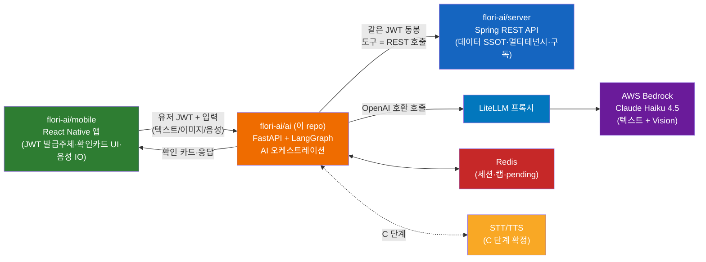
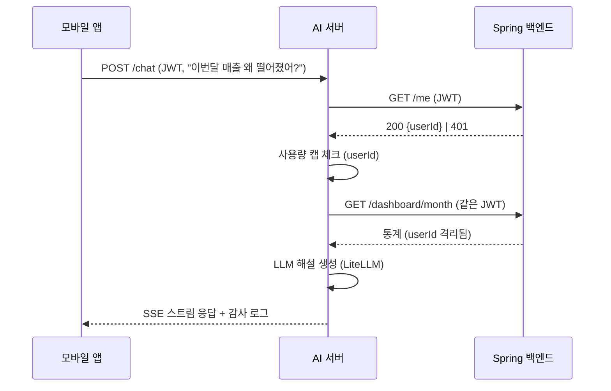

# Flori AI — 설계 (SSOT)

> Flori 꽃집 SaaS 프리미엄 AI 서비스 설계. 2026-05-25 작성. **사용자 승인 게이트** — 본 문서 승인 후 구현(SPEC-AI-001) 착수.
> 백엔드 REST 표면은 `~/Desktop/hazel-server`(Spring/Kotlin) 기준. 구조 참고(복붙 금지): `~/Desktop/kikoai/ai`.

## 1. 배경 & 미션

바쁜 1인 꽃집 사장을 위한 AI 비서. 별도 FastAPI + LangGraph 서비스로, **백엔드 DB에 직접 접근하지 않고** 기존 Spring REST API를 도구로 호출한다.

- **A 데이터 분석**: "이번 달 매출 왜 떨어졌어?" → 통계 API를 읽어 LLM 해설 (읽기전용)
- **B OCR→예약**: 카톡 스크린샷 → 비전 LLM 추출 → 확인 카드 → 예약 생성
- **C 음성**: 음성 지시 → STT → 에이전트 → 음성 응답 (C1 푸시투토크 → C2 실시간)
- **D 에이전트**: A·B·C 도구를 묶은 다단계·선제 제안

설계 1순위 = **보안(멀티테넌시)**. AI는 god-mode를 받지 않고, 유저 JWT를 백엔드에 그대로 전달해 Spring이 격리·게이팅을 강제한다.

## 2. 전체 아키텍처



**핵심 흐름**: 앱이 유저 JWT와 입력을 AI 서버에 보냄 → AI 서버가 LangGraph로 의도 파악 → 백엔드 REST 도구를 **같은 JWT로** 호출(읽기) 또는 쓰기 제안 → 확인 카드 → 확인 시 쓰기 실행. LLM 호출은 모두 LiteLLM 프록시 경유.

## 3. 기술 스택

Python 3.12+ / uv / FastAPI + uvicorn / LangGraph(StateGraph·ReAct) / LiteLLM proxy → Bedrock Claude Haiku 4.5 / `langchain-openai`(OpenAI 호환) / Pydantic v2 / httpx(async) / Redis / Langfuse(v1 선택) / pytest · ruff.

## 4. 모듈 / 디렉토리 구조

레이어: `api(전송) → graphs/agents(오케스트레이션) → tools(백엔드 래퍼) → core/infra(횡단)`. 도메인 기능(A/B/C/D)은 모듈 추가로 확장.

```
app/
├── main.py                 # FastAPI 앱 + lifespan (Redis 풀, LiteLLM 워밍업) + CORS
├── api/                    # 전송 계층 (라우터)
│   ├── health.py           # GET /health (no auth)
│   ├── chat.py             # POST /chat (A/B/D 텍스트·이미지 턴, SSE 스트림)
│   ├── confirm.py          # POST /confirm (쓰기 제안 확인 → 실행)
│   └── voice.py            # C1 푸시투토크 (HTTP/SSE) → C2에서 WS 추가
├── agents/                 # LangGraph 에이전트
│   ├── graph.py            # StateGraph 빌드 (intent → tools → respond)
│   ├── state.py            # Pydantic 상태 (session_id, turns, pending_writes)
│   ├── react_loop.py       # ReAct 루프 (iteration cap·토큰 버짓·타임아웃)
│   ├── llm_client.py       # LiteLLM 경유 ChatOpenAI 싱글톤 (bind_tools)
│   └── prompts.py          # 시스템 프롬프트 + [USER INPUT — DATA ONLY] 펜스
├── tools/                  # 백엔드 REST 도구 (얇은 래퍼, 단일 소스 레지스트리)
│   ├── registry.py         # 도구 등록 + Pydantic 인자 스키마 + 읽기/쓰기 분류
│   ├── analytics.py        # A: dashboard/sales/customers/expenses/insights 읽기
│   ├── reservations.py     # B/C: reservation 읽기 + 생성(쓰기, 게이팅)
│   └── customers.py        # find-or-create 등
├── backend/                # 백엔드 REST 클라이언트
│   ├── client.py           # httpx async, JWT 패스스루, 재시도·타임아웃·에러 매핑
│   └── auth.py             # /me 인트로스펙션 (JWT 검증 + userId 추출)
├── session/                # 대화 세션 추상화 (전송계층 독립)
│   ├── store.py            # Redis 세션 스토어 (session_id + 턴 히스토리)
│   ├── models.py           # Turn / Message / ConfirmationCard / PendingWrite
│   └── transport.py        # Transport ABC (HTTP/SSE → WS/WebRTC 교체점)
├── voice/                  # C 단계 (STT/TTS 프로바이더 추상화)
│   ├── stt.py              # STT Port (Transcribe/Clova/OpenAI 구현 교체)
│   └── tts.py              # TTS Port
├── core/
│   ├── config.py           # env 설정 (Pydantic Settings)
│   ├── usage.py            # 유저별 사용량 캡 (Redis 카운터)
│   ├── audit.py            # AI 행위 감사 로깅 (구조화, PII 마스킹)
│   └── errors.py           # 표준 에러 + 핸들러
├── observability/          # Langfuse @observe 래퍼 (no-op 폴백) — v1 선택
└── models/                 # 공유 요청/응답 DTO (Pydantic v2)
```

`hazel-server`의 `controller → service → repository`에 대응하는 AI 레이어 = `api → agents → tools → backend`. **DB 레이어 없음** — 영속은 전부 백엔드, AI는 Redis(휘발성 세션·캡)만 소유.

## 5. 보안 모델 (핵심)

### 5.1 멀티테넌시 — JWT 패스스루 [HARD]
- 앱이 백엔드(`/auth/login`)에서 받은 access JWT(`Authorization: Bearer <token>`, HS256, `sub=userId`)를 AI 서버에 전달.
- AI 서버는 **JWT를 서명검증·발급하지 않는다.** 서명키를 AI 서버에 두면 god-mode가 되므로 금지.
- 모든 백엔드 도구 호출에 **받은 JWT를 그대로 동봉** → `TenantContext`가 Spring에서 userId 격리를 강제. 구독 게이팅(`@RequiresSubscription`)도 그대로 적용.

### 5.2 경량 검증 — `/me` 인트로스펙션
- AI 서버는 작업 착수 전 `GET /me`를 호출해 (a) JWT 유효성 확인(200/401), (b) `userId` 추출(사용량 캡·감사 로깅용)을 한다.
- 결과는 짧게 캐시(예: 60초)해 매 턴 호출 비용을 줄인다. 401이면 즉시 거부.
- 장점: JWT 서명키를 공유하지 않고도 인증·신원 확보. 백엔드가 단일 진실원.



### 5.3 프롬프트 인젝션 방어
- 사용자 입력(스크린샷 OCR 텍스트 포함)은 시스템 프롬프트에서 `[USER INPUT — DATA ONLY]` 펜스로 격리.
- 도구 인자는 Pydantic 화이트리스트 검증 — LLM이 임의 경로/메서드를 호출 못 함(레지스트리에 등록된 도구만).

### 5.4 쓰기 게이팅 (human-in-loop) [HARD]
- 읽기 도구는 LLM이 자유 호출. **쓰기 도구는 직접 실행 금지** — 대신 `PendingWrite`(제안)를 만들어 `ConfirmationCard`로 앱에 반환.
- 앱이 카드를 렌더 → 사용자가 확인 → `POST /confirm {proposal_id}` → AI 서버가 그 시점에 실제 백엔드 쓰기(JWT 동봉) 실행.
- `PendingWrite`는 Redis에 TTL로 저장(세션·userId 바인딩, 위변조 방지). 초기엔 항상 확인, 신뢰 쌓이면 저위험 쓰기 자동화 점진 완화.

### 5.5 사용량 캡 · 감사 로깅
- 캡: 유저별 호출수/토큰을 Redis 카운터로(예: 일/월 윈도우), 구독 등급 연동. 초과 시 429.
- 감사: 모든 AI 행위(턴·도구 호출·쓰기 제안/확인/실행)를 구조화 로깅(JSON). PII(전화·이름) 마스킹. v1은 stdout + (선택)Langfuse, durable 필요 시 백엔드 내부 엔드포인트 추가.

## 6. 도구 카탈로그 (백엔드 REST 래퍼)

각 도구 = `hazel-server` 엔드포인트의 얇은 래퍼. 행동공간 = 검증된 API 표면. **읽기는 자유, 쓰기는 게이팅.**

### 6.1 읽기 도구 (A 데이터 분석 — LLM 자유 호출)
| 도구 | 백엔드 | 용도 |
|------|--------|------|
| `get_month_dashboard(month?)` | `GET /dashboard/month` | 월 매출/지출/카테고리·결제수단·채널·고객 통계 (매출 분석 핵심) |
| `get_today_dashboard()` | `GET /dashboard/today` | 오늘 요약·다가오는 예약·리마인더 |
| `list_sales(month?, filters?)` | `GET /sales` | 매출 목록(카테고리/결제/채널 필터) |
| `get_customer_sales(customerId)` | `GET /customers/{id}/sales` | 고객별 매출 |
| `list_customers()` | `GET /customers` | 고객 목록(구매통계, 총액순) |
| `list_expenses(month?)` | `GET /expenses` | 지출 목록 |
| `list_reservations(month)` | `GET /reservations` | 월별 예약 |
| `get_upcoming_reservations()` | `GET /reservations/upcoming` | 다가오는 예약 |
| `get_deposit_summary(month?)` | `GET /deposits/summary` | 카드 입금 요약 |
| `list_insights_trends(...)` | `GET /insights/trends` | 트렌드(분석 보조) |

### 6.2 쓰기 도구 (B/C — 확인 카드 경유)
| 도구 | 백엔드 | 게이팅 |
|------|--------|--------|
| `propose_reservation(date, time?, customerName, customerPhone?, title, amount?, reminderAt?)` | `POST /reservations` | 제안 → 확인 카드 → 확인 시 실행 |
| `find_or_create_customer(name, phone)` | `POST /customers/find-or-create` | 예약 생성 전 고객 해소(확인 플로우 내부) |
| (후속) `update_reservation`, `complete_pickup`, `convert_to_sale` | `PATCH /reservations/{id}` 등 | 동일 게이팅 |

> 도구 인자는 백엔드 DTO 필드와 1:1(예약 생성: `date`*, `time?`, `customerName`*, `customerPhone?`, `title`*, `description?`, `amount`, `reminderAt?`). `userId`는 JWT에서 백엔드가 주입하므로 인자에 없음.

## 7. 대화 세션 추상화 (전송계층 독립)

C1(HTTP/SSE)→C2(WebSocket/WebRTC) 전환 시 **전송계층만 교체**하도록, 처음부터 세션·턴을 추상화.

- `Session{ session_id, user_id, turns[], pending_writes[], lang }` — Redis 저장(TTL).
- `Turn` = 입력(user_text | user_image | user_audio) → 처리(tool_calls) → 출력(assistant_text | assistant_audio | confirmation_card).
- `Transport` ABC: `send(event)` / `stream()` — HTTP·SSE 구현 먼저, WS/WebRTC는 같은 인터페이스로 추가. 에이전트/도구 로직은 transport를 모름.
- 메시지 이벤트 타입은 채널 무관(텍스트/음성 공통). 음성은 STT로 텍스트화 후 동일 그래프 진입, 응답은 TTS로 음성화.

## 8. LLM / LiteLLM 연동

- 모든 LLM·Vision 호출은 LiteLLM 프록시(`LITELLM_BASE_URL`) 경유, OpenAI 호환 클라이언트로. 모델명 `claude-haiku-4-5`.
- B의 OCR도 동일 멀티모달 모델(이미지 + 추출 스키마 프롬프트 → 구조화 JSON).
- 로컬 LiteLLM config 형식 (`litellm-config.yaml`, 단일 모델):

```yaml
model_list:
  - model_name: claude-haiku-4-5
    litellm_params:
      model: bedrock/us.anthropic.claude-haiku-4-5-20251001-v1:0
      aws_region_name: us-east-1
litellm_settings:
  request_timeout: 120
  num_retries: 2
general_settings:
  master_key: os.environ/LITELLM_MASTER_KEY
```

## 9. 기능별 설계

### 9.1 A — 데이터 분석 (SPEC-AI-002, 읽기전용)
- 진입: `POST /chat` 텍스트 턴. ReAct 루프가 6.1 읽기 도구를 호출 → LLM이 수치를 근거로 해설("객단가 ↓, 카드결제 비중 ↑" 등).
- 가장 저렴·저위험 → **도구콜 루프를 끝까지 검증**하는 기준점. 쓰기 없음.

### 9.2 B — OCR→예약 (SPEC-AI-003) ✅ 구현
- `POST /ocr/reservation {image_url}` → 비전 LLM(Haiku 4.5)이 `ReservationDraft{customer_name, customer_phone?, date, time?, title, amount?}` 추출(`app/agents/vision.py`).
- 추출 결과는 **제안일 뿐** — `PendingWrite`(Redis, proposal_id·user_id 바인딩·TTL·1회성)로 저장하고 `ConfirmationCard`를 반환.
- `POST /confirm {proposal_id}` → 소유자 검증 → `app/confirm/executor.py`가 `POST /reservations`(JWT 패스스루) 실행. 미존재/만료 404, 타 유저 403, 실행 후 삭제.
- **쓰기 게이팅**: 에이전트 ReAct 루프는 is_write 도구를 차단(직접 실행 불가). 쓰기는 confirm 경유만.

### 9.3 C — 음성 (SPEC-AI-004 C1 ✅ → SPEC-AI-005 C2)
- C1 푸시투토크 ✅: `POST /voice/turn`(audio base64) → STT → `run_agent`(A 재사용) → TTS → 음성(base64) 반환. 세션 턴 기록(kind=audio). `app/voice/pipeline.py`.
- **STT/TTS = AWS Transcribe/Polly**(확정). Port 추상화(`app/voice/ports.py`) — `SttProvider`/`TtsProvider`. 어댑터 `app/voice/aws.py`(`TranscribeStt` 스트리밍, `PollyTts` boto3, voice=Seoyeon, ko-KR). 실 AWS 호출은 인프라에서 검증.
- C2 실시간 ✅: `WS /voice/stream`(WebSocket 전송, `app/api/voice_ws.py`) — **전송계층만 교체**하고 `run_voice_turn` 재사용. 멀티턴·session_id sticky, 쿼리 토큰 인증, 오디오 누적 상한, event 프로토콜(transcript/reply/audio/error/done). WebRTC(TURN/시그널링) + 서브-발화 실시간 partial/바지인(Transcribe 스트리밍 실시간 공급)은 인프라 필요 → 후속.

### 9.4 D — 에이전트 확장 (SPEC-AI-006) ✅ 구현
- **선제 제안** `GET /agent/proactive`: 읽기 도구(`/dashboard/today`·`/reservations/upcoming`)로 컨텍스트 수집 → LLM이 `Suggestion{title, detail}` 목록 생성(`app/agents/proactive.py`). 읽기전용·fail-open. 컨텍스트는 데이터로 펜스 격리.
- **관측성** `app/observability/tracing.py`: `@observe` seam — Langfuse env 설정 시 트레이싱, 미설정 시 no-op 패스스루(fail-open). `run_agent`·proactive에 적용.
- 선제 제안도 쓰기는 자동 실행하지 않음 — 실행은 B의 confirm(human-in-loop) 경유.

## 10. 시퀀싱 (ROADMAP 연계)

`SPEC-AI-001`(Foundation) → `002`(A) → `003`(B) → `004`(C1) → `005`(C2) → `006`(D). 상세·인수기준은 `ROADMAP.md` + 각 `.moai/specs/<ID>/spec.md`.

## 11. 테스트 / 품질

- 게이트: `uv run ruff check . && uv run pytest`.
- 단위: 도구 인자 검증, JWT 패스스루, 쓰기 게이팅(확인 없이는 백엔드 쓰기 호출 0건), 사용량 캡, 세션 추상화.
- 백엔드 호출은 httpx mock(respx). 멀티테넌시 회귀: 다른 userId JWT로 격리 확인.
- 프롬프트 인젝션 케이스(OCR 텍스트에 명령 주입 시도) 테스트.

## 12. 로컬 개발

- `docker-compose`: `ai-server`(이 repo) + `redis`. LiteLLM은 호스트/외부 prod 사용(`LITELLM_BASE_URL`).
- 인프라(EC2/ECR/Bedrock 액세스/배포)는 범위 밖 — 사용자가 직접.

## 13. 범위 밖
- 백엔드 코드 변경(필요 시 별도 repo에서). DB 직접 접근. 실제 배포/인프라. 결제 연동(백엔드 담당).

## 14. 결정 필요 / 열린 질문 (승인 시 확인)

1. **`/me` 인트로스펙션 캐시 TTL** — 60초 제안. 더 짧게/길게?
2. **사용량 캡 정책** — 무엇을 기준(턴 수/토큰/비용)으로, 윈도우(일/월)는? 구독 등급별 한도는 백엔드에서 받아올지(`GET /subscription`) AI가 자체 테이블로 둘지.
3. **확인 카드 스키마** — ✅ 확정(SPEC-AI-003). `ConfirmationCard{proposal_id, action, summary, fields:[{label,value}], expires_at(ISO UTC)}`. 앱(`flori-ai/mobile`)은 이 계약으로 카드를 렌더하고 `POST /confirm {proposal_id}`로 확정. (필드 편집 후 수정 payload 전송은 후속 확장)
4. **세션 식별** — `session_id`를 앱이 생성/전달할지, AI가 발급할지. 디바이스/유저 단위?
5. **감사 로그 durable 저장** — v1 Redis+stdout로 시작 후, 백엔드에 `POST /internal/ai-audit` 추가할지.
6. **STT/TTS 프로바이더** — C 단계에서 확정(보류).
7. **CI** — 현재 `.github/workflows/ci.yml`은 Python(uv+ruff+pytest)로 조정, 코드 없는 동안 graceful skip. AI-001에서 정식 동작.
