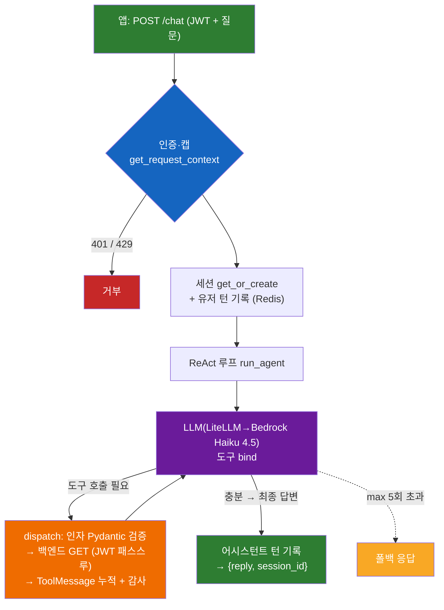

# A — 데이터 분석 (`POST /chat`)

> SPEC-AI-002 · 읽기전용. 전체 그림: [../ARCHITECTURE.md](../ARCHITECTURE.md)

## 개요
사장님이 자연어로 물으면("이번 달 매출 왜 떨어졌어?") AI가 **백엔드 통계 읽기 API를 도구로 호출**해 실제 숫자를 모은 뒤 그 숫자에 근거해 해설한다. 데이터를 바꾸지 않는다.

> 도구콜은 직접 구현한 **ReAct 루프**(`langchain-openai` `bind_tools` + `langchain_core` 메시지)로 동작. LangGraph `StateGraph`는 골격(AI-001)으로만 존재하고 이 경로엔 쓰지 않음.

## 사용 스택 · 모델
| 영역 | 사용 |
|------|------|
| 웹 | FastAPI `POST /chat` |
| LLM | langchain-openai `ChatOpenAI`(`bind_tools`) → LiteLLM → **Bedrock Claude Haiku 4.5** (`claude-haiku-4-5`) |
| 메시지/툴 | langchain_core.messages + Pydantic v2 도구 스키마 |
| 백엔드 호출 | httpx(async), JWT 패스스루 |
| 세션 | Redis (session_id + 턴) |
| 관측성 | `@observe`(Langfuse seam, no-op 가능) |

## 아키텍처 레이어
| 레이어 | 파일 | 역할 |
|--------|------|------|
| 전송 | `app/api/chat.py` | `POST /chat`, 세션 턴 기록 |
| 인증·캡 | `app/api/deps.py` → `app/backend/auth.py`, `app/core/usage.py` | `/me` 인트로스펙션 + 일일 캡 |
| 오케스트레이션 | `app/agents/react_loop.py` | ReAct 루프(LLM↔도구), iteration cap, 감사 |
| 프롬프트 | `app/agents/prompts.py` | 분석가 페르소나 + `[USER INPUT — DATA ONLY]` 펜스 |
| LLM 팩토리 | `app/agents/llm_client.py` | LiteLLM 경유 ChatOpenAI |
| 도구 | `app/tools/registry.py` | 읽기 도구 + 디스패치 + OpenAI 스키마 |
| 백엔드 클라이언트 | `app/backend/client.py` | httpx, JWT 패스스루, 재시도/에러매핑 |
| 세션 | `app/session/store.py` | Redis get/append(소유자 검증) |

## 도구 카탈로그 (전부 `is_write=False`)
| 도구 | 백엔드 | 인자 | 용도 |
|------|--------|------|------|
| `get_month_dashboard` | `GET /dashboard/month` | `month?`(YYYY-MM) | 월 매출/지출/카테고리·결제·채널·고객 통계 |
| `get_today_dashboard` | `GET /dashboard/today` | — | 오늘 요약·다가오는 예약 |
| `list_sales` | `GET /sales` | `month?` | 매출 목록 |
| `list_customers` | `GET /customers` | — | 고객 목록(구매통계) |

## 플로우

1. 앱이 `POST /chat {message, session_id?}` + `Authorization: Bearer <JWT>`
2. 인증(`/me` 검증·userId, 60s 캐시) + 사용량 캡(무효 401 / 초과 429)
3. 세션 get_or_create(소유자 검증) + 유저 턴 기록
4. ReAct 루프: `[시스템 프롬프트 + 히스토리 + 펜스 격리된 질문]` → LLM(도구 bind) → 도구 호출 시 dispatch(인자 검증 → 백엔드 GET, JWT 패스스루 → ToolMessage 누적 + 감사) → 다시 LLM → 충분하면 해설 텍스트(최대 5회)
5. 어시스턴트 턴 기록 → `{reply, session_id}`

## 핵심 설계 포인트
- **읽기 전용**: 모든 도구 `is_write=False`, 쓰기 도구는 디스패치 차단
- **멀티테넌시**: 도구가 JWT를 백엔드에 패스스루 → 격리는 Spring이 강제
- **프롬프트 인젝션 방어**: 질문을 `[USER INPUT — DATA ONLY]`로 격리
- **행동 공간 = 검증된 API**: 레지스트리 등록 도구만 호출, 인자 오류·백엔드 오류는 에러 dict로 돌려 self-correction
- **비용 가드**: iteration cap(5) + 일일 캡 + 도구 결과 truncate

## 관련 파일 · 테스트
- 구현: `app/api/chat.py`, `app/agents/{react_loop,prompts,llm_client}.py`, `app/tools/registry.py`
- 테스트: `tests/test_chat.py`, `tests/test_react_loop.py`, `tests/test_tools.py`
