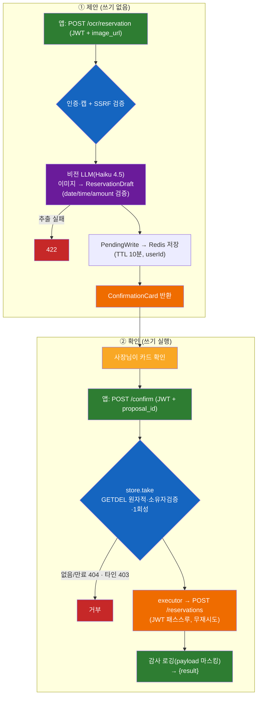

# B — OCR→예약 (`POST /ocr/reservation` → `POST /confirm`)

> SPEC-AI-003 · **첫 쓰기 경로**(human-in-loop). 전체 그림: [../ARCHITECTURE.md](../ARCHITECTURE.md)

## 개요
카톡 스크린샷을 **비전 LLM**이 읽어 예약 후보(고객·날짜·시간·품목·금액)를 추출 → **확인 카드**로 제시 → 사장님이 확인하면 그때 백엔드에 예약 생성. **2단계(제안 → 확인)**. AI는 제안만, 실제 쓰기는 확인 후.

## 사용 스택 · 모델
| 영역 | 사용 |
|------|------|
| 비전 모델 | **Bedrock Claude Haiku 4.5 (멀티모달)** via LiteLLM — A와 동일 모델, 이미지+텍스트 처리 |
| 멀티모달 호출 | `HumanMessage(content=[{type:text}, {type:image_url}])` |
| 추출 스키마 | Pydantic `ReservationDraft` (date·time·amount 검증, `extra=forbid`) |
| 제안 저장 | Redis `PendingWriteStore` (proposal_id·user_id 바인딩, TTL 10분, 1회성 GETDEL) |
| 백엔드 쓰기 | httpx `POST /reservations` (JWT 패스스루, **재시도 없음**) |

> 입력은 **이미지 URL**(클라이언트가 접근 가능한 URL 제공).

## 아키텍처 레이어
| 레이어 | 파일 | 역할 |
|--------|------|------|
| 전송 ① 제안 | `app/api/ocr.py` | `POST /ocr/reservation` — SSRF 검증 → 추출 → 카드 |
| 전송 ② 확인 | `app/api/confirm.py` | `POST /confirm` — 제안 소진 → 쓰기 실행 |
| 비전 추출 | `app/agents/vision.py` | 멀티모달 LLM → JSON 파싱 → `ReservationDraft` |
| 데이터 모델 | `app/confirm/models.py` | `ReservationDraft`, `ConfirmationCard`, `ConfirmationField` |
| 제안 저장소 | `app/confirm/store.py` | `PendingWriteStore`(Redis, 소유자·TTL·1회성) |
| 쓰기 실행 | `app/confirm/executor.py` | `execute` → `POST /reservations` |

## 엔드포인트 · 계약
| 엔드포인트 | 입력 | 출력 | 백엔드 호출 |
|-----------|------|------|------------|
| `POST /ocr/reservation` | `{image_url}` | `ConfirmationCard` | ❌ (제안만 저장) |
| `POST /confirm` | `{proposal_id}` | `{action, result}` | ✅ `POST /reservations` |

```json
// ConfirmationCard (앱 공유 계약)
{
  "proposal_id": "a1b2...",
  "action": "create_reservation",
  "summary": "2026-05-26 14:00 · 김미영 · 장미 다발",
  "fields": [{"label": "고객", "value": "김미영"}, {"label": "날짜", "value": "2026-05-26"}],
  "expires_at": "2026-05-26T...Z"
}
```

## 플로우 (2단계)


1. `POST /ocr/reservation {image_url}` + JWT → 인증·캡 → **SSRF 검증**(스킴 + 사설/루프백 IP 차단)
2. 비전 추출: 멀티모달 LLM에 `[이미지 + 추출 프롬프트]` → `ReservationDraft`(date=YYYY-MM-DD, time=HH:MM, amount≥0, 잡필드 차단). 실패 시 422
3. `PendingWrite` → Redis 저장(proposal_id·user_id·10분 TTL) → `ConfirmationCard` 반환 *(여기까지 쓰기 0건)*
4. 사장님 확인 → `POST /confirm {proposal_id}` + JWT
5. `store.take`: **GETDEL 원자 조회+삭제**(동시확인 이중실행 방지) + 소유자 검증(타인 403) + 1회성(재확인 404)
6. `executor` → `POST /reservations`(JWT 패스스루, **무재시도** = 중복예약 방지)
7. 감사 로깅(`write_executed`, PII 마스킹) → `{action, result}`

## 핵심 설계 포인트
- **human-in-loop 쓰기 게이팅**: LLM 출력은 제안일 뿐, 쓰기는 `/confirm` 호출해야만 발생 → AI 단독 예약 불가
- **제안 위변조/재사용 방지**: user_id 바인딩 + TTL + 1회성(GETDEL)
- **payload 오염 방어**: `extra=forbid` + 필드 포맷 검증
- **SSRF 방어**: 내부망/메타데이터(169.254.x) 차단
- **쓰기 멱등성**: 5xx에도 재시도 안 함

## 관련 파일 · 테스트
- 구현: `app/api/{ocr,confirm}.py`, `app/agents/vision.py`, `app/confirm/{models,store,executor}.py`
- 테스트: `tests/test_vision.py`, `tests/test_confirm.py`, `tests/test_ocr_confirm_api.py`, `tests/test_ai003_hardening.py`
