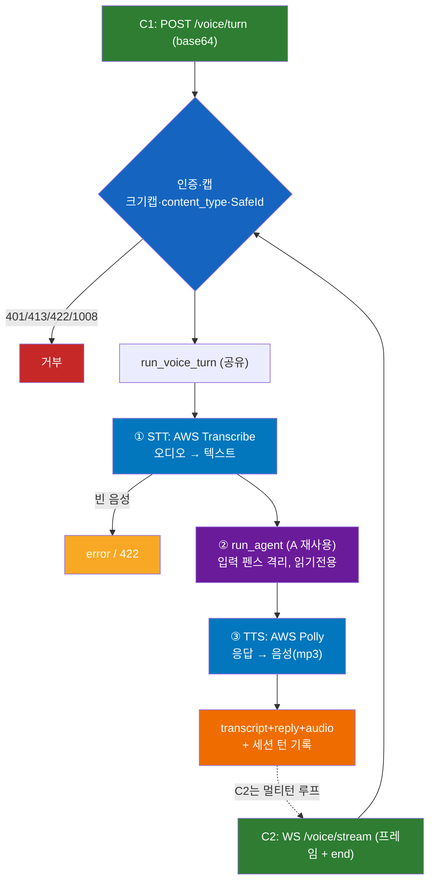

# C — 음성 (C1 `POST /voice/turn` · C2 `WS /voice/stream`)

> SPEC-AI-004(C1) · SPEC-AI-005(C2). 전체 그림: [../ARCHITECTURE.md](../ARCHITECTURE.md)

## 개요
음성 지시를 받아 처리. **핵심은 "전송계층만 교체"** — C1·C2 둘 다 동일한 파이프라인(`run_voice_turn`)을 재사용하고, 그 안은 A의 ReAct 에이전트를 그대로 쓴다(STT 앞단, TTS 뒷단).
- **C1**: 녹음 후 통째 업로드(HTTP). "워키토키"
- **C2**: WebSocket 한 연결로 프레임 흘려보내며 멀티턴. "전화 통화"

> 정직한 한계: 현재 C1·C2 모두 "오디오 누적 → 통째 인식 → 응답"(턴 단위). 진짜 실시간(말하는 도중 부분인식·바지인)은 프레임 도착 즉시 Transcribe에 흘리는 후속 작업(인프라 필요). C2의 이점은 **연결 유지 + 멀티턴**.

## 사용 스택 · 모델
| 영역 | 사용 |
|------|------|
| STT | **AWS Transcribe(스트리밍)** — `amazon-transcribe`, ko-KR, partial 무시·final 누적 |
| TTS | **AWS Polly** — boto3, 음성 **Seoyeon**, **neural**, mp3 |
| 에이전트 | A의 ReAct 루프 그대로 (LiteLLM → Bedrock Haiku 4.5) |
| Port 추상화 | `SttProvider`/`TtsProvider` Protocol — 프로바이더 교체 가능 |
| C1 전송 | FastAPI HTTP, 오디오 = base64 |
| C2 전송 | FastAPI WebSocket, 오디오 = 바이너리 프레임, 토큰 쿼리 인증 |

## 아키텍처 레이어
| 레이어 | 파일 | 역할 |
|--------|------|------|
| 전송 C1 | `app/api/voice.py` | `POST /voice/turn` (base64, 크기캡·content_type 화이트리스트) |
| 전송 C2 | `app/api/voice_ws.py` | `WS /voice/stream` (토큰 인증·멀티턴·타임아웃·event 프로토콜) |
| 공유 파이프라인 | `app/voice/pipeline.py` | `run_voice_turn`: STT → `run_agent`(A) → TTS |
| Port | `app/voice/ports.py` | `SttProvider`/`TtsProvider` + `VoiceProviderError` |
| AWS 어댑터 | `app/voice/aws.py` | `TranscribeStt`(스트리밍), `PollyTts`(Seoyeon/neural) |

## C1 vs C2
| 항목 | C1 `POST /voice/turn` | C2 `WS /voice/stream` |
|------|----------------------|----------------------|
| 전송 | HTTP 단발 | WebSocket(연결 유지) |
| 오디오 | base64 (1요청=1턴) | 바이너리 프레임 누적 + `{type:end}` |
| 멀티턴 | 매번 새 요청 | 한 연결에서 연속, session_id sticky |
| 인증 | `Authorization: Bearer`(헤더) | `?token=`(쿼리, 실패 시 close 1008) |
| 응답 | `{transcript, reply, audio_base64, ...}` | event 스트림 `{transcript}→{reply}→{audio}→{done}` |
| 공통 | 둘 다 `run_voice_turn` 재사용 + 인증·캡 + 크기캡·content_type 화이트리스트·SafeId | |

## 플로우 (공유 파이프라인 + 2개 전송 front)

1. 앱이 오디오 전송 — C1은 `POST /voice/turn`(base64), C2는 WS로 프레임 누적 후 `{type:"end"}`
2. 게이트: 인증·캡 + 오디오 크기 상한(10MB) + content_type 화이트리스트(wav/pcm/ogg) + session_id SafeId
3. **① STT**: Transcribe로 오디오 → 텍스트. 빈 음성이면 거부(C1 422 / C2 error)
4. **② 에이전트**: transcript를 A의 ReAct 루프에 투입(입력 펜스 격리, 읽기전용)
5. **③ TTS**: 응답 → Polly(Seoyeon) mp3
6. 세션에 턴 기록(kind=audio) → 응답. **C2는 연결 유지하며 다음 턴 반복(session_id sticky)**

## 핵심 설계 포인트
- **"전송계층만 교체" 실증**: C1(HTTP)·C2(WS)가 동일 `run_voice_turn` 호출 → 음성 로직 중복 0
- **Port 추상화**: STT/TTS가 Protocol 뒤에 있어 AWS→Clova/OpenAI 교체 시 어댑터만
- **A 에이전트 재사용 = 보안 일관성**: 음성으로도 에이전트는 읽기전용. 음성 예약은 B의 확인 카드 경유
- **인프라 격리**: 실 AWS 스트리밍 호출은 인프라 검증(`# pragma: no cover`), 나머지 전부 TDD
- **WS 하드닝**: 토큰 인증(1008), 유휴/턴 타임아웃, 오디오 상한, 예외 catch-all, 감사

## 관련 파일 · 테스트
- 구현: `app/api/{voice,voice_ws}.py`, `app/voice/{pipeline,ports,aws}.py`
- 테스트: `tests/test_voice_pipeline.py`, `tests/test_voice_aws.py`, `tests/test_voice_api.py`, `tests/test_voice_ws.py`, `tests/test_ai004_hardening.py`
