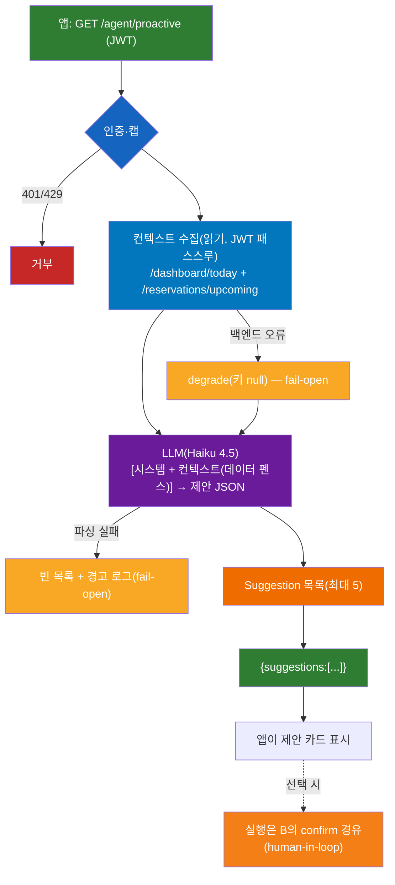

# D — 에이전트 확장 (`GET /agent/proactive` + 관측성)

> SPEC-AI-006. 전체 그림: [../ARCHITECTURE.md](../ARCHITECTURE.md)

## 개요
두 가지: ① **선제 제안** — 사장님이 묻기 전에 AI가 **A의 읽기 도구로 컨텍스트(오늘 요약·다가오는 예약)를 수집**해 다음 할 일을 제안("내일 예약 3건, 리마인더 보낼까요?"). ② **관측성 seam** — Langfuse 트레이싱 자리(env 설정 시 on, 없으면 no-op).

## 사용 스택 · 모델
| 영역 | 사용 |
|------|------|
| 웹 | FastAPI `GET /agent/proactive` |
| 컨텍스트 수집 | A 읽기 도구(`/dashboard/today`, `/reservations/upcoming`), httpx, JWT 패스스루 |
| 제안 생성 | Bedrock Claude Haiku 4.5 via LiteLLM |
| 제안 스키마 | Pydantic `Suggestion{title, detail}` |
| 관측성 | Langfuse `@observe`(seam), `langfuse_*` env, no-op 폴백 |
| 폴백 | fail-open — 백엔드/파싱 실패 시 빈 목록 |

## 아키텍처 레이어
| 레이어 | 파일 | 역할 |
|--------|------|------|
| 전송 | `app/api/proactive.py` | `GET /agent/proactive` (인증·캡) |
| 제안 로직 | `app/agents/proactive.py` | `generate_proactive_suggestions` — 컨텍스트 읽기 → LLM 제안 |
| 관측성 | `app/observability/tracing.py` | `@observe` — Langfuse 위임 or no-op |
| 적용 지점 | `run_agent`, `generate_proactive_suggestions` | `@observe` 데코레이트 |

## 엔드포인트 · 계약
| 엔드포인트 | 입력 | 출력 |
|-----------|------|------|
| `GET /agent/proactive` | (JWT) | `{suggestions: [{title, detail}]}` |

```json
{"suggestions": [
  {"title": "내일 예약 3건", "detail": "리마인더를 보낼까요?"},
  {"title": "이번 주 매출 점검", "detail": "카드매출 비중이 늘었어요."}
]}
```

## 플로우


1. `GET /agent/proactive` + JWT (대시보드 진입/정기 호출) → 인증·캡
2. 컨텍스트 수집: `/dashboard/today` + `/reservations/upcoming`(JWT 패스스루). 실패 시 그 키만 null로 두고 진행(degrade)
3. LLM 제안: `[시스템 프롬프트 + 컨텍스트(`[CONTEXT — DATA ONLY]` 펜스)]` → 제안 JSON
4. 파싱 → `Suggestion` 목록(최대 5). 오류면 빈 목록 + 경고 로그(fail-open)
5. `{suggestions:[...]}` → 앱이 카드 표시 → 선택 시 실행은 B의 confirm(human-in-loop) 경유

## 관측성 seam
| 상태 | 동작 |
|------|------|
| Langfuse env 미설정(현재) | `@observe`는 함수 그대로 반환(no-op), 영향 0 |
| Langfuse env 설정 시 | `run_agent`·proactive 실행이 트레이스로 자동 기록 |

`langfuse_secret_key`는 `SecretStr`(로그 노출 방지). 키 부재/오류가 본 기능을 막지 않음(fail-open).

## 핵심 설계 포인트
- **A·B·C를 "묶는" 확장**: 선제 제안이 A 읽기 도구로 컨텍스트를 만들고 LLM이 해석
- **fail-open**: 제안은 보조 기능 → 실패해도 본 기능 안 막음
- **제안 ≠ 실행**: 선제 제안도 자동 실행 안 함, 실행은 B의 confirm 경유
- **프롬프트 인젝션 방어**: 컨텍스트도 `[CONTEXT — DATA ONLY]`로 격리
- **관측성은 seam**: no-op 폴백, 나중에 env로 켜기

## 관련 파일 · 테스트
- 구현: `app/api/proactive.py`, `app/agents/proactive.py`, `app/observability/tracing.py`
- 테스트: `tests/test_proactive.py`, `tests/test_tracing.py`
