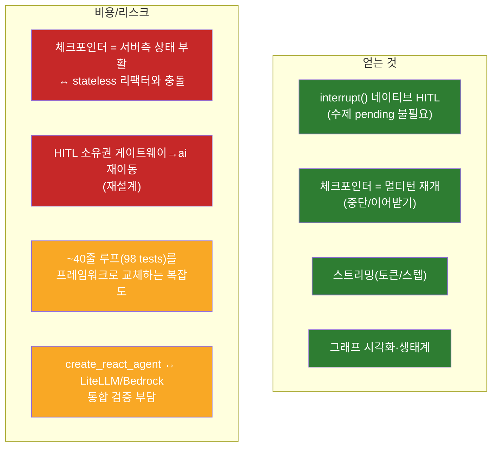

# ai-D — LangGraph 채택 평가 (구현 아님 / 설계 합의용)

> 작성: 2026-06-04 · 상태: **결론 = 조건부 보류(DEFER)** · 범위: 평가/설계 문서까지만(코드 변경 없음)

프롬프트 팩 `[ai-D]`에 따른 평가다. 현재 수제 ReAct 루프를 LangGraph로 전환할지,
전환한다면 **어떤 조건이 충족될 때** 할지를 코드 근거로 판정한다.

---

## 1. 현재 상태 (as-built, 코드 근거)

| 항목 | 현재 구현 | 근거 |
|------|-----------|------|
| 에이전트 루프 | 수제 ReAct `for` 루프(bind_tools → tool_calls 디스패치 → ToolMessage 누적 → 최종응답), `max_iterations` cap | `app/agents/react_loop.py` |
| 병렬 도구 | 한 턴의 독립 tool_calls를 `asyncio.gather`로 병렬 | `react_loop.py` (이번 세션 적용) |
| 상태/세션 | **ai-server는 stateless** — 대화 히스토리는 게이트웨이가 `messages`로 전달, ai-server는 소유 안 함 | `app/api/chat.py`, `app/api/deps.py`, HANDOFF 2026-06-04 |
| 쓰기 HITL | **게이트웨이가 소유** — `/ocr/reservation`은 draft만 반환, 제안 보관·확인(`/ai/confirm`)·예약 생성은 게이트웨이 | `app/api/ocr.py` docstring, HANDOFF |
| `confirm/executor.py` | **dead code** — 어떤 라우터에도 연결 안 됨(리팩터로 `/confirm` 제거됨) | `grep` 결과: executor 미참조 |
| `graph.py` | echo 스켈레톤(미사용) | `app/agents/graph.py` |
| 음성(C) | `run_voice_turn`은 여전히 Redis `SessionStore` 사용(stateful) — 멀티턴 sticky | `app/voice/pipeline.py`, `app/api/voice_ws.py` |

> ⚠ **프롬프트 팩 ai-D 전제 일부가 stale**: 팩은 "Redis GETDEL human-in-loop이
> (ai-server에서) 동작 중"이라 했으나, 2026-06-04 게이트웨이 전환(PR #7) 이후
> ai-server의 HITL 쓰기 게이팅은 **게이트웨이로 이동**했고 `confirm/*`는 잔재(dead code)다.
> 따라서 "LangGraph `interrupt()`로 HITL을 대체" = 단순 라이브러리 교체가 아니라
> **HITL 소유권을 게이트웨이→ai-server로 되돌리는 재설계**가 된다(아래 §3 핵심 리스크).

---

## 2. LangGraph 대안 (공식 권장 매핑)

| 현재 | LangGraph 대안 | 공식 출처 |
|------|----------------|-----------|
| 수제 ReAct for-loop | `create_react_agent`(표준 ReAct) | langgraph |
| 분기/다단계 토폴로지 | `StateGraph` + `Annotated[list, add_messages]` | langgraph |
| 직렬/수동 tool 디스패치 | `ToolNode`(asyncio.gather 내장) | langgraph |
| (없음) 멀티턴 재개 | 체크포인터 `AsyncRedisSaver`(Redis 이미 보유) | langgraph |
| (게이트웨이) 쓰기 확인 | `interrupt()` + `Command(resume=)` | LangChain interrupt 블로그 |

---

## 3. 전환 trade-off

**핵심 긴장점**: ai-server는 2026-06-04 리팩터로 **의도적으로 stateless**(상태·세션·HITL =
게이트웨이 소유)가 되었다. LangGraph의 두 핵심 가치(체크포인터·`interrupt()`)는 모두
**서버측 상태를 ai-server로 되돌릴 것을 요구**한다. 즉 LangGraph 전환은 라이브러리 선택이
아니라 **"상태/HITL 소유권을 게이트웨이에서 ai-server로 되가져올 것인가"**라는 아키텍처
질문이다. 이 질문이 "그렇다"가 되기 전에는 전환 이득의 절반이 발현되지 않는다.

---

## 4. 전환 트리거 조건 (이 중 ≥2 충족 시 재평가)

| # | 트리거 | 현재 | 비고 |
|---|--------|------|------|
| T1 | 노드 3개 이상 / 비선형 분기 토폴로지가 필요 | ✗ (선형 ReAct로 충분) | A/B/C/proactive 모두 단일 루프 |
| T2 | 진행 중 에이전트 런의 **durable 멀티턴 재개**가 필요하고, 그 상태를 **ai-server가** 소유 | ✗ (게이트웨이 소유) | T 충족의 핵심 = 소유권 이동 결정 |
| T3 | 클라이언트로 **부분 토큰/스텝 스트리밍**이 필요 | ✗ (현재 단발 응답) | 실시간 음성 심화 시 가능 |
| T4 | HITL 쓰기 게이팅을 **ai-server `interrupt()`**로 운영 | ✗ (게이트웨이 `/ai/confirm`) | 소유권 이동 결정 동반 |
| T5 | 멀티 에이전트 / 서브그래프 / supervisor 패턴 | ✗ | D 심화 시 |

---

## 5. 권고

- **지금은 보류(DEFER).** 수제 루프는 A·B·C·D(proactive)에 충분하고 98 tests로 고정돼 있다.
  병렬 도구·구조화 출력·관측성은 이번 세션에서 프레임워크 없이 확보했다.
- **재평가 시점**: 위 트리거 **T1~T5 중 2개 이상**, 특히 **T2/T4(상태·HITL 소유권의
  ai-server 회귀)** 또는 **T3(스트리밍)**이 현실화될 때.
- **전환 시 방식**: drive-by 리라이트 금지. 별도 세션에서 단계적으로
  ① 상태 스키마(`TypedDict + add_messages`) → ② 노드 분리(`create_react_agent`/`ToolNode`)
  → ③ 체크포인터(`AsyncRedisSaver`) → ④ `interrupt()` HITL. 각 단계 회귀 테스트 통과.
- **정리 작업(전환과 무관, 선택)**: `app/agents/graph.py`(echo 스켈레톤)·`app/confirm/executor.py`
  (dead code)는 전환 전이라도 제거/주석으로 의도 명확화 가능 — 별도 PR 권장.

---

## 부록 — 출처
- LangGraph: https://github.com/langchain-ai/langgraph
- interrupt/HITL: https://www.langchain.com/blog/making-it-easier-to-build-human-in-the-loop-agents-with-interrupt
